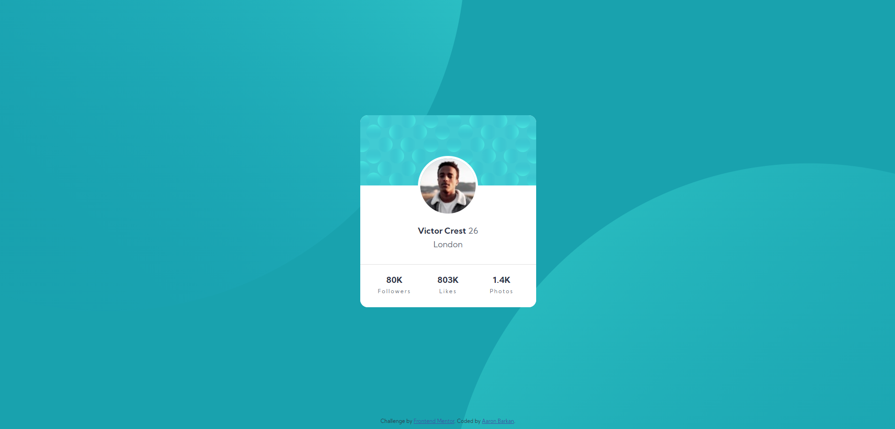

# Frontend Mentor - Profile card component solution

This is a solution to the [Profile card component challenge on Frontend Mentor](https://www.frontendmentor.io/challenges/profile-card-component-cfArpWshJ). Frontend Mentor challenges help you improve your coding skills by building realistic projects.

## Table of contents

- [Overview](#overview)
  - [The challenge](#the-challenge)
  - [Screenshot](#screenshot)
  - [Links](#links)
- [My process](#my-process)
  - [Built with](#built-with)
  - [What I learned](#what-i-learned)
  - [Useful resources](#useful-resources)
- [Author](#author)
- [Acknowledgments](#acknowledgments)

## Overview

### The challenge

- Build out the project to the designs provided

### Screenshot



### Links

- Solution URL: [Add solution URL here](https://your-solution-url.com)
- Live Site URL: [Add live site URL here](https://your-live-site-url.com)

## My process

### Built with

- Semantic HTML5 markup
- CSS custom properties
- Bootstrap 5
- Mobile-first workflow

### What I learned

1. I learned to center elements in the x and y axes using Bootstrap 5, for example:

```html
<div class="card-wrapper position-absolute start-50 top-50 translate-middle">
  .
  .
  .
</div>
```

2. I learned to disable content overflow from a div, using overflow: hidden:

```css
.wrapper {
  height: 100%;
  overflow: hidden;
  width: auto;
  position: relative;
}
```

3. All in all, I think that I'm getting better at mobile-first workflow.


### Useful resources

- [Bootstrap 5 Position Utilities](https://getbootstrap.com/docs/5.0/utilities/position/) - This helped me for centering elements. I really liked this pattern and will use it going forward.

## Author

- Website - [Aaron Barkan](https://0rokusaki.github.io/cv/)
- Frontend Mentor - [@0rokuSaki](https://www.frontendmentor.io/profile/yourusername)

## Acknowledgments

I would like to thank Angela from Udemy and her amazing course for getting me this far.
